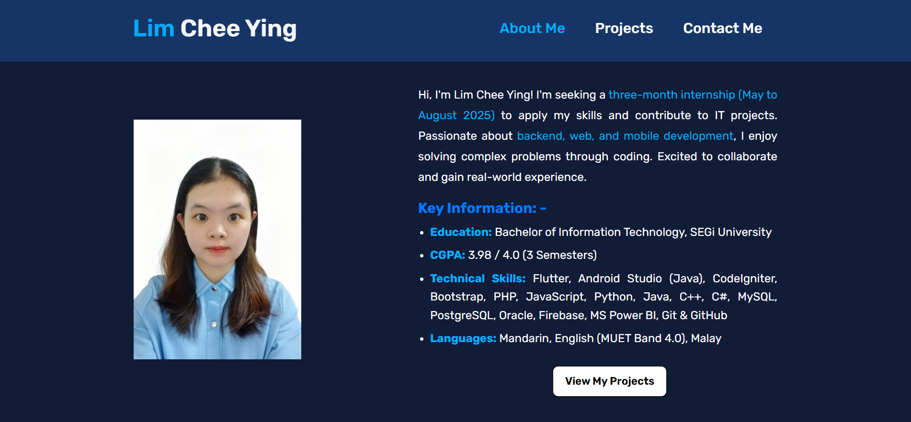
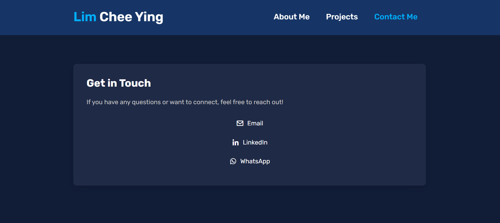

# Portfolio Website
This personal portfolio website highlights my project experience and skills. It is designed to be fully responsive across both mobile and desktop devices and is built using web technologies such as HTML, CSS, and JavaScript.

## Demo
🔗 [Live Website](https://limcheeying.github.io/portfolio/)

## Relevant System Screenshots
### Home Page  
  

### About Me Page  
  

### Contact Me Page  
  

## Contact  
📧 **Email**: [cyingg0000@gmail.com](mailto:cyingg0000@gmail.com)  
🔗 **LinkedIn**: [linkedin.com/in/limcheeying](https://www.linkedin.com/in/limcheeying/)